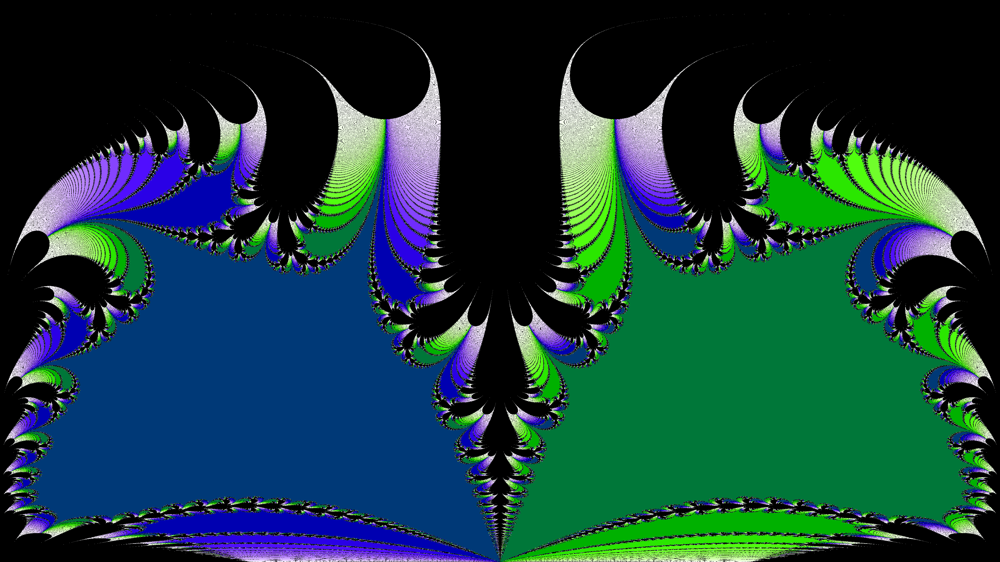

+++
title = "Fractals on the Riemann Sphere"
date = 2016-12-06
description = "In order to investigate the behaviour of Newton Fractals at infinity, I've plotted Newton Fractals on the Riemann sphere. Here's an animated video of a Newton Fractal plotted on the Riemann sphere using youtubes 360° video feature."

[extra]
revised = 2019-01-19
keywords = "fractal, newton fractal, riemann sphere, dual numbers"
+++

In order to investigate the behaviour of [Newton Fractals][newton-intro] at
infinity, I've plotted Newton Fractals on the Riemann sphere. Here's an
animated video of a Newton Fractal plotted on the Riemann sphere using
YouTube's 360&deg; video feature:

<!-- more -->

<iframe class="youtube-16-9" width="560" height="315" src="https://www.youtube.com/embed/ErmEzYHugm8" frameborder="0" allowfullscreen></iframe>

Since I was making videos for YouTube, I decided that I might as well animate
the newton fractals by generating many newton fractals where I vary the
function slightly. Since I was making a lot of fractals, which was taking a
long time, I decided to do the computations on the GPU for this project.  This
was also my first time using the GPU.

The code I wrote to generate these videos can be found [on GitHub][github]. In
general, using the GPU wasn't very difficult. I could essentially write the
function I wanted to run using normal C++ code, so I won't go into further
details about this here. You can read [the code][gpucu] yourself if you want.

There are, however, two things, that I do want to explain: How one creates 360°
videos for YouTube, and how I use dual numbers to make changing the function
easier.

## Dual numbers

Having to define both the function and its derivative sucks. Luckily we can get
away with only the function by using [dual numbers][dual numbers].

In dual numbers, we add a new value &epsilon; to the number system. This new
value satisfies the identity &epsilon;<sup>2</sup>&nbsp;=&nbsp;0, similar to
how the imaginary unit is introduced for complex numbers. This is cool because
the Taylor expansion of <i>f</i>(<i>x</i>+&epsilon;) around <i>x</i> can be
written in following form:

<div class="display-style">
  <i>f</i>(<i>x</i>+&epsilon;) = <i>f</i>(<i>x</i>) + <i>f</i><div
     class="kern3"></div>ʹ(<i>x</i>)&middot;&epsilon; +
   O(<i>x</i><sup>2</sup>)&middot;&epsilon;<sup>2</sup>
</div>

This means every term beside the first two are multiplied by
&epsilon;<sup>2</sup>, which is zero, allowing us to write
<i>f</i>(<i>x</i>+&epsilon;) simply as <i>f</i>(<i>x</i>) + <i>f</i><span
class="kern3"></span>ʹ(<i>x</i>)&middot;&epsilon;. More generally we have
<i>f</i>(<i>x</i>+<i>a</i>&epsilon;)&nbsp;=&nbsp;<i>f</i>(<i>x</i>)
   + <i>af</i><span class="kern3"></span>ʹ(<i>x</i>)&middot;&epsilon;.

Using these properties, you can type the function once in your program, and
when you evaluate the function at the dual number <i>x</i>+&epsilon;, you
obtain the value and derivative at that point.  My implementation of these
numbers can be found in [the GitHub repository][dualcu].

## 360&deg; videos

In order for a 360&deg; video to be displayed properly on YouTube, it has to be
encoded using an [equirectangular projection][equirectangular].  This means
that the <i>x</i> coordinate is mapped to the longitude, and the <i>y</i>
coordinate is mapped to the latitude. In other words, a vertical line in the
image corresponds to a straight line from the top of the sphere to the bottom
of the sphere, and each horizontal line corresponds to a horizontal ring in the
sphere. This means the 'resolution' of the image will be higher at the top and
bottom than in the middle.


<div class="caption">
  A newton fractal on the Riemann sphere shown using an equirectangular
  projection.
</div>

Since I was making newton fractals, I needed to map the pixels to complex
numbers. On the Riemann sphere, one can compute the complex number
corresponding to a specific longitude and latitude using the formula

<div class="display-style">
  <i>z</i> = tan(φ)&middot;e<sup>i<div class="kern1"></div>λ</sup>,
</div>

where φ is the latitude, and λ is the longitude. Then all there is left is to
linearly scale the parameters to match the resolution of the image.

### Marking video files as spherical

The last important bit is how one can tell YouTube that the video is spherical,
and not flat. This is pretty easy using the [Python tool “spatial
media”][spatial-media].  The commands I used to make my video files spherical
are the following:

```text
$ git clone --depth=1 https://github.com/google/spatial-media spatial-media
$ python2 ./spatial-media/spatialmedia/__main__.py -i flat-video.mp4 spherical-video.mp4
```

Depending on your setup you might need to run it as just `python`, instead of
`python2` like I did.

[newton-intro]: @/blog/newton-intro/index.md
[dual numbers]: https://en.wikipedia.org/wiki/Dual_number
[github]: https://github.com/Darksonn/newton-riemann
[gpucu]: https://github.com/Darksonn/newton-riemann/blob/master/src/gpu.cu
[dualcu]: https://github.com/Darksonn/newton-riemann/blob/master/src/dual.cu
[equirectangular]: https://en.wikipedia.org/wiki/Equirectangular_projection
[spatial-media]: https://github.com/google/spatial-media
