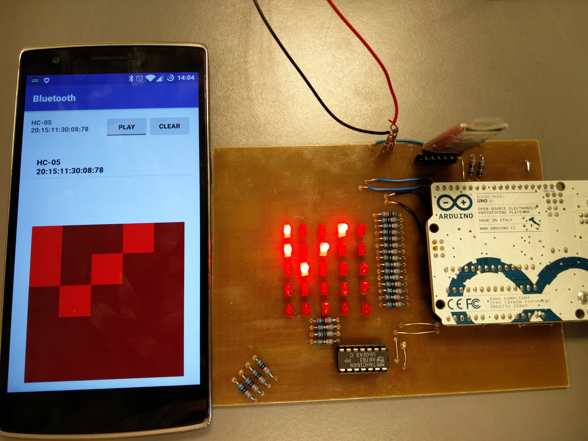
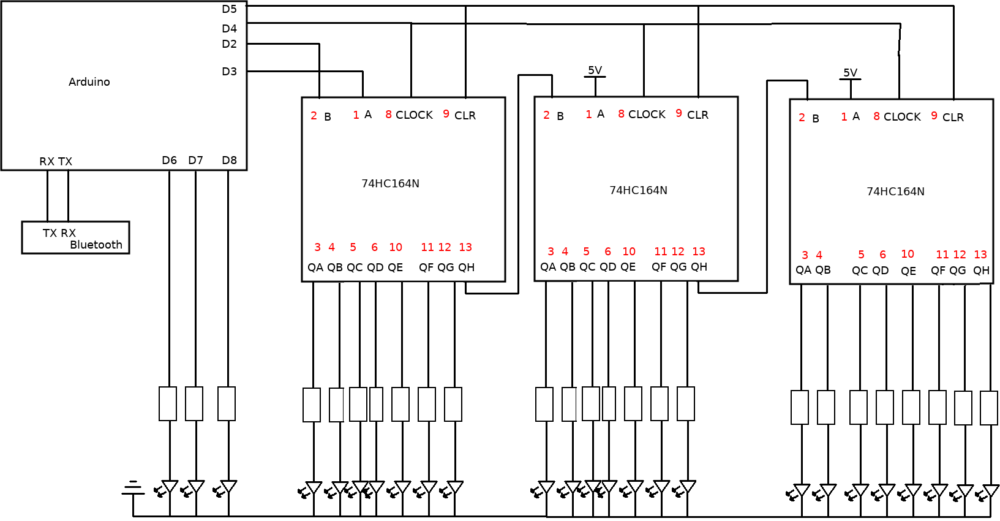
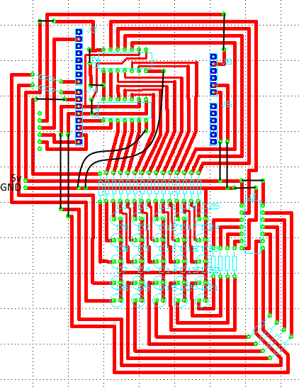
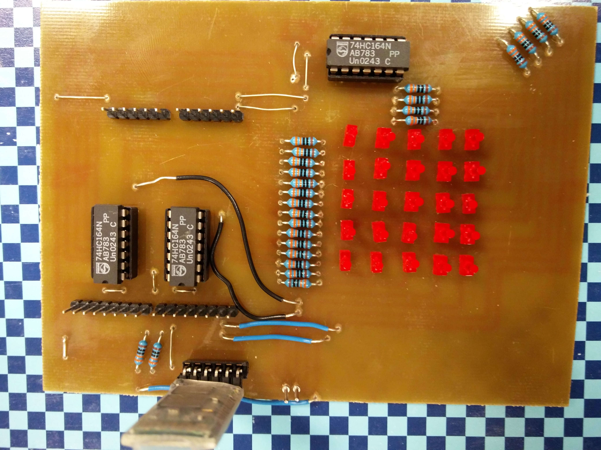
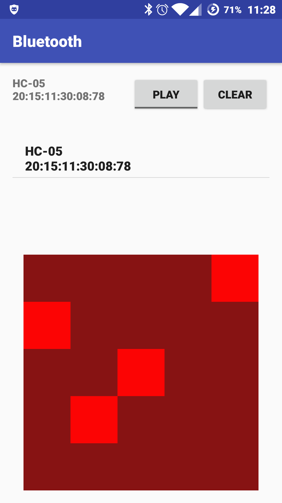

+++
title = "The Game of Life on a PCB"
date = 2016-12-18
description = "I've chosen to make a PCB that simulates the game of life on a 5 by 5 LED grid, and can be remote controlled with Bluetooth. Here is a video of the finished product:"

[extra]
revised = 2019-01-20
keywords = "game of life, electronics, arduino"
+++


I've created a printed circuit board (PCB) that simulates the game of life on a
5&nbsp;by&nbsp;5 LED grid, and can be remote controlled with Bluetooth.  The project was
created in collaboration with another student as a school project.  Here is a video of
the finished product:

<!-- more -->

<iframe class="youtube-4-3" src="https://www.youtube.com/embed/m9UT01vAzbw" frameborder="0" allowfullscreen></iframe>
<div class="caption">
  The PCB simulating a glider in the game of life.
</div>

<div class="tm15"></div>


<div class="caption">
  An image showing the circuit board and the app for remote control.
</div>

## What is The Game of Life?

[The Game of life][gol] is a simulation that runs in a two-dimensional grid of cells.
The simulation is run in steps, where the next step depends only on the state of the
previous. Each cell in the simulation is either dead or alive in each step.

### Rules for computing the next step

The simulation is built from three rules dictating the state of each cell.  The state of
each cell in the next step, is found by first counting how many of the 8 cells around it
are live, and using one of these rules:

 * If there are 2 alive neighbours, the state of the cell is not changed.
 * If there are 3 alive neighbours, the cell is alive in the next step.
 * Otherwise, the cell is dead in the next step.

This is performed on every cell in the grid, and results in the next state.
Often when simulating the game of life, the grid is infinitely large, but I
don't have that many LEDs, so my grid is just a 5&nbsp;by&nbsp;5 grid. There
are two ways to handle finite grids: Just let the grid have an edge, or let
it wrap around.  I've chosen to let the grid wrap around, since this allows
me to have a glider, that goes on forever.

### The Glider


The configuration shown in the video at the start of the article is called a glider. It
is a pattern that moves forever, and is small enough fit in my 5&nbsp;by&nbsp;5 grid,
without interfering with itself over the edges.  This is the best way to show the wrap
around in this grid.

## Hardware

The main challenge in this project is that the Arduino UNO doesn't have enough digital
outputs to control 25 LEDs. I solved this problem by adding 3 shift registers, on which I
push the state of the LEDs.

### What is a shift register?

A shift register traditionally has 2 inputs and *n* outputs. Initially all the outputs of
the shift register are LOW. The first input is called VAL and the second is called CLOCK.
Every time the CLOCK input changes from LOW to HIGH, the first output is changed so it's
the same as the VAL input, and the second output is changed so it's the same as the first
output and so on.  Since it takes *n* updates to the shift register, it allows you
to trade ease of updating the outputs for more outputs.

The reason we use a shift register in this project is to control many LEDs with a small
amount of outputs from the Arduino. I chain shift registers by connecting the last output
from each shift register to the VAL input of the next, which allows me to control all the
LEDs connected to the three shift registers, using a small amount of outputs from the
Arduino.

In the Arduino code I have an array that maps an LED coordinate to the index in the shift
register, which is how the code knows how to control each LED.

The shift register used in this project has a few additional inputs: A, B, CLOCK and CLR.
The VAL input I mentioned earlier is split into the inputs A and B, and the VAL input is
regarded to have the value true only if both A and B are true. The CLR input just sets
all outputs to low.

In order to update the board once, the Arduino has to write to the shift
registers 24 times. The reason that it needs to write 24 times, even though
3 LEDs are connected directly to the Arduino is elaborated on in the
Imperfections section.

### The final design

The shift registers I used are called 74HC164N.


<div class="caption">
  The design of the PCB quickly created in paint. All resistors are 330
  &Omega;.
</div>

The circuit board is very simple; it just chains some integrated circuits and connects
them to LEDs. The resulting layout, which I created from the design above, is shown
below:


<div class="caption">
  The layout of the PCB. All resistors are 330 &Omega; and all integrated circuits are
  74HC164N.
</div>

In hindsight, I probably shouldn't have placed the 5V and ground inputs so close to each
other. Here's a picture of the finished PCB:


<div class="caption">
  The finished PCB. The board was just barely not wide enough for the
  layout, so I changed one of the outer traces to a wire.
</div>

## Software

The software consists of two components:  the Arduino code and the Android
app.

### Arduino

The Arduino code is available [here][code]. The code needs to handle two things
simultaneously: Running the game of life and receiving commands over Bluetooth. Bluetooth
works by have the function `serialEvent` run every time new data is received via
Bluetooth. To avoid changes to the `gol` array while the next step is being computed, the
changes received via Bluetooth are stored in a separate array, and committed to the `gol`
array when the step computation has completed. This results in a `loop` function like the
one below:

```c
void loop() {
  // if we are not paused, compute the next the game of life step
  if (!paused) {
    delay(750);
    gol_step();
  }
  // move changes from the changes array to the gol array
  // the changes array is updated in the handleSerialData function,
  // when a bluetooth command decides to update the board
  int i;
  for (i = 0; i < 25; ++i) {
    int x = i % 5, y = i / 5;
    if (changes[x][y] != 2) {
      gol[x][y] = changes[x][y];
      changes[x][y] = 2;
    }
  }
  // move the gol array to the array, which correctly maps coordinates to LEDs
  for (i = 0; i < 25; ++i) {
    set(i % 5, i / 5, gol[i%5][i/5] == 1 ? HIGH : LOW);
  }
  // actually update the LEDs
  write_config();
}
```

Bluetooth works by sending a stream of characters, so some method of marking the end of a
message is needed. In this project I've opted for delimiting commands with an exclamation
mark. The Arduino code accepts the command `clr!`, which clears the board, the commands
`g 0!` and `g 1!`, which pause and unpause the board, and `[LED id] [0 or 1]!`, which
turns a LED on or off.

### Android

The Android code was written entirely by my partner in this project, so this section will
be short. The android code is available [here][android], and a picture of the app is
shown below:


<div class="caption">
  Screenshot of the app created for this project.
</div>

In order for the app to keep in sync with the Arduino, updates must be sent both back and
forth. Updates are sent from the phone to the Arduino when the user interacts with the
app, and the entire state is sent from the Arduino to the app when the Arduino computes
the next the game of life step.

## Imperfections

Unfortunately there are some imperfections present in this project. The main one has to
do with the design of the circuit board. If you look at the Arduino code, you will see
the following workaround:

```c
// Stores the configuration of the board.
char configuration[27];
// maps a coordinate to an LED
int mapping[5][5] = {
  {26, 25, 24, 23, 22},
  {1, 0, 21, 20, 19},
  {3, 2, 18, 17, 15},
  {5, 4, 14, 12, 13},
  {7, 6, 11, 10, 9}
};
```

Notice how the `configuration` array has the length 27 instead of 25?  Notice how the
`mapping` array doesn't have an entry for 8 and 16?  These details are because the QH
outputs of the shift registers aren't connected to an LED, like the other outputs are.
Instead, they are just connected to the input of the next shift register.

This means that the Arduino has to control 3 LEDs directly, instead of just one.

[gol]: https://en.wikipedia.org/wiki/Game_of_life
[code]: https://github.com/Darksonn/gol-pcb-arduino
[android]: https://github.com/Darksonn/gol-pcb-android
