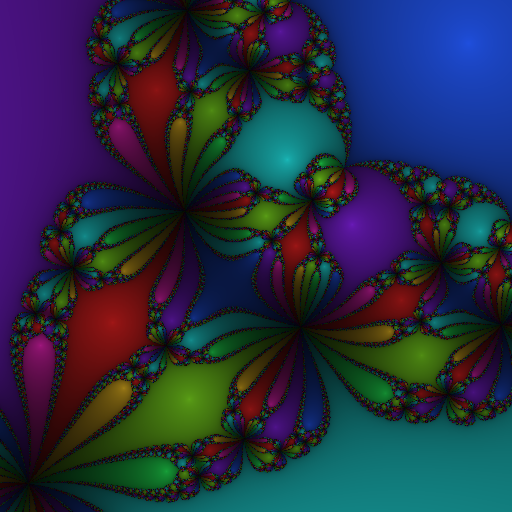
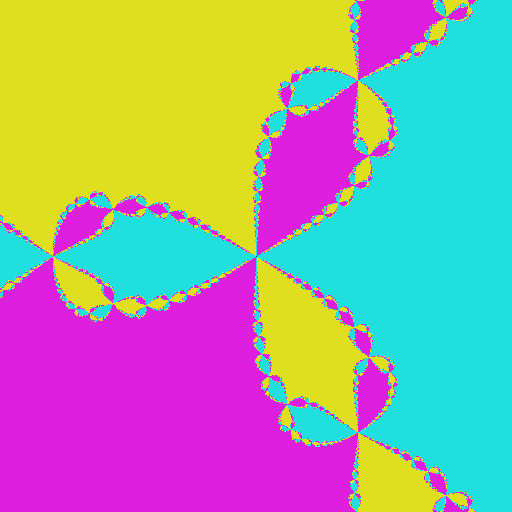
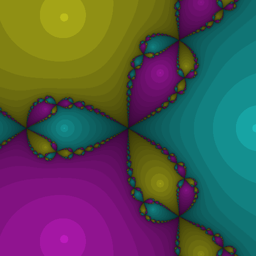
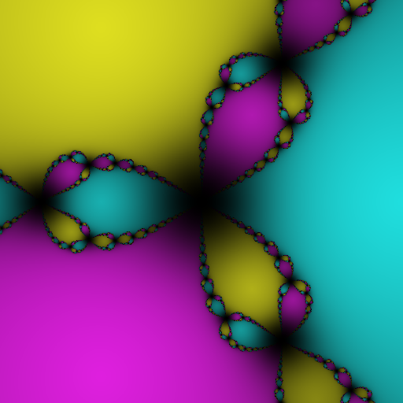
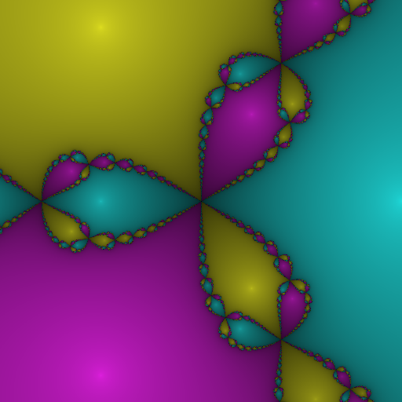

+++
title = "Introduction to Newton Fractals"
date = 2016-10-30
description = "When I try to learn a new programming language, I don't write a hello world. Instead, I write a generator of newton fractals."

[extra]
revised = 2019-01-19
keywords = "fractal, newton fractal, fsharp, F#"
+++

When I try to learn a new programming language, I don't write a hello world. Instead, I
write a generator of newton fractals. Here's an example of a newton fractal:

<!-- more -->


<div class="caption">
    Newton fractal for <i>z</i><sup>8</sup><div class="kern3"></div>+<div
      class="kern3"></div>15<div class="kern1"></div><i>z</i><sup>4</sup><div
      class="kern3"></div>&minus;<div class="kern3"></div>16 in the square
    from 0.5+0.5i to 1.5+1.5i.
</div>

## What is a newton fractal?

To understand what newton fractals are, you first need to understand what [Newton's
method][newton] is.

[newton]: https://en.wikipedia.org/wiki/Newtons_method

Newton's method is a way to approximate solutions to an equation of the form
<i>f</i>(<i>x</i>) = 0. To use the method, first try to guess a solution
<i>x</i><sub>0</sub> to the equation, and use the following formula:

<div class="display-style">
  <i>x</i><sub><i>n</i>+1</sub> = <i>x<sub>n</sub></i> &minus;
  <div class="frac">
    <div class="fracouter">
      <div class="fracnum">
        <i>f</i>(<i>x<sub>n</sub></i>)
      </div>
    </div>
    <div class="fracouter">
      <div class="fracden">
        <i>f</i><div class="kern3"></div>ʹ(<i>x<sub>n</sub></i>)
      </div>
    </div>
  </div>
</div>

The value <i>x</i><sub>1</sub> that you calculate with this formula will be
closer to a solution than <i>x</i><sub>0</sub> was. If you want an even
better approximation to the solution, just repeat the formula on
<i>x</i><sub>1</sub> to obtain <i>x</i><sub>2</sub>. You can repeat this as
many times as you want, to obtain a solution that is as precise as you want.

Some equations have multiple solutions, and the solution you converge to is
determined by the initial guess. This is what forms the basis for creating
the fractal. The wikipedia page says the method works on real-valued
functions, but it works just fine on complex-valued functions as well.

An interesting thing to investigate is then, which root do the different
starting guesses converge to? Below is shown some F# code which creates an
image with each pixel given a colour corresponding to the root that it
converged to. I picked the function <i>f</i>(<i>x</i>) =
<i>x</i><sup>3</sup>&minus;1 as the one used in the iteration step, since
it's a rather simple function, that's not so simple it doesn't show any
fractal behaviour.

```fsharp
open System
open System.Drawing

(* pick the region of the complex plane to show *)
let width = 512
let height = 512
let center = new C(0.0, 0.0)
let scale = 256.0 (* how many pixels per unit *)

(* pick a complex number from the pixel coordinate *)
let tc x w = (float x - 0.5*float w) / scale
let transform (x,y) = center + new C(tc x width, tc y height)

(* how many times we improve the guess *)
let iterations = 100

(* the function and its derivative *)
let f x = x*x*x - new C(1.0, 0.0)
let fd x = new C(3.0, 0.0) * x*x

(* computes one iteration *)
let step z = z - (f z) / (fd z)

(* computes n iterations *)
let rec compute_pixel z n = if n = 0 then z else compute_pixel (step z) (n - 1)

(* picks a color for the pixel
 * this function uses the function hsltorgb,
 * which is not included here for briefness *)
let complex_to_color (z:C) =
  let (r,g,b) = hsltorgb (z.Phase, 0.75, 0.5)
  Color.FromArgb(r, g, b)

(* functions to compute the color of a pixel *)
let newton z = compute_pixel z iterations
let newton_pixel x y = transform (x,y) |> newton |> complex_to_color

(* create an image *)
let bitmap = new Bitmap(width, height)
for px = 0 to width-1 do
  for py = 0 to height-1 do
    bitmap.SetPixel(px, py, newton_pixel px py)
bitmap.Save("fractal.png", System.Drawing.Imaging.ImageFormat.Png)
bitmap.Dispose
```

The code shown here also depends on the function `hsltorgb` which is excluded for
brevity, and is available [here][hsltorgb].  Running this code produces the following
image:

[hsltorgb]: hsltorgb.fs


<div class="caption">
  Newton fractal for <i>z</i><sup>3</sup><div
    class="kern3"></div>&minus;<div class="kern3"></div>1 in the square from
  &minus;1&minus;<div class="kern1"></div>i to 1+<div class="kern1"></div>i.
</div>
<p>
With a preliminary result like this, it's clear that this has the potential
to create very interesting and pretty images.

## Prettier fractals

In the image above I ran 100 iterations for every pixel, but this is
probably way more than necessary. Instead, we can stop when the iteration
changes the result by something very small. This also allows us to create a
more interesting image: we can change the darkness depending on the amount
of iterations we made before stopping. We make the following chances to the
code:

```fsharp
(* now only performs as many iterations as necessary,
 * returns the amount of iterations performed too *)
let compute_pixel (z:C) =
  let rec aux z n =
    let z2 = step z
    if (z2 - z).Magnitude < 0.001 || n > 100 then (z2,n) else aux z2 (n+1)
  aux z 0

(* incorporate the amount of iterations in the color *)
let complex_to_color (z:C,n) =
  let (r,g,b) = hsltorgb (z.Phase, 0.75, 0.5 / (1.+0.18*float n))
  Color.FromArgb(r, g, b)

let newton z = compute_pixel z
```

Running the updated code produces the following image:


<div class="caption">
  Newton fractal for <i>z</i><sup>3</sup><div
    class="kern3"></div>&minus;<div class="kern3"></div>1 in the square from
  &minus;1&minus;<div class="kern1"></div>i to 1+<div class="kern1"></div>i.
</div>

It would be even nicer if we could make the brightness change smoothly. If
you're okay with foregoing the optimization of only running as many
iterations as necessary, you can make the colour change smoothly. In the
previous image the darkness was chosen from the amount of iterations
performed. To have the darkness change smoothly, compute the sum of the
distances from the values <i>x</i><sub>i</sub> to the root it converged to,
and base the darkness on that sum. The following changes to the code
incorporates this:

```fsharp
let compute_pixel (z:C) =
  let rec aux z n =
    let z2 = step z
    if n > 100 then (z2,0.0) else
      let (zf,sum) = aux z2 (n+1)
      let delta = (z - zf).Magnitude
      (zf, sum + delta)
  aux z 0

(* incorporate the amount of iterations in the color *)
let complex_to_color (z:C,n) =
  let (r,g,b) = hsltorgb (z.Phase, 0.75, 0.5 / (1.+0.18*n))
  Color.FromArgb(r, g, b)
```

Running the updated code produces the following image:


<div class="caption">
  Newton fractal for <i>z</i><sup>3</sup><div
    class="kern3"></div>&minus;<div class="kern3"></div>1 in the square from
  &minus;1&minus;<div class="kern1"></div>i to 1+<div class="kern1"></div>i.
</div>

This is better than before, but adding the distances linearly doesn't quite
give the gradient I want. The following code applies a sublinear function to
the distance before adding them together:

```fsharp
let compute_pixel (z:C) =
t rec aux z n =
let z2 = step z
if n > 100 then (z2,0.0) else
  let (zf,sum) = aux z2 (n+1)
  let delta = (z - zf).Magnitude
  (zf, sum + 1.0 - 1./(1.+exp (delta+3.5)-exp 3.5))
x z 0
```

Running the updated code produces the following image:


<div class="caption">
  Newton fractal for <i>z</i><sup>3</sup><div
    class="kern3"></div>&minus;<div class="kern3"></div>1 in the square from
  &minus;1&minus;<div class="kern1"></div>i to 1+<div class="kern1"></div>i.
</div>

The final code is available [here][final].

[final]: intro.fsx
